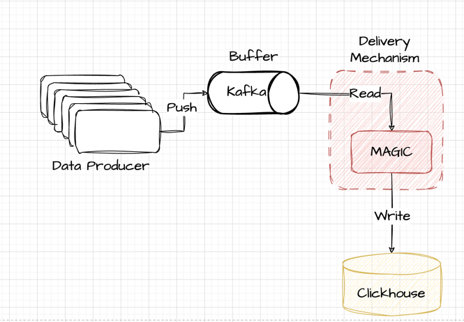
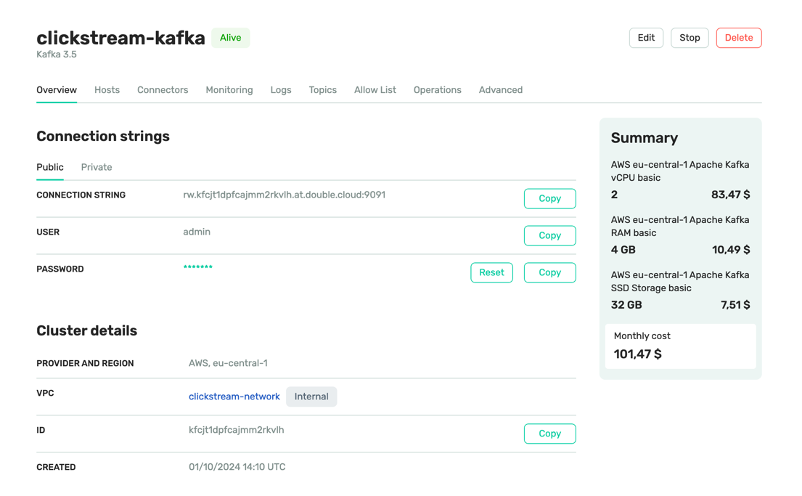
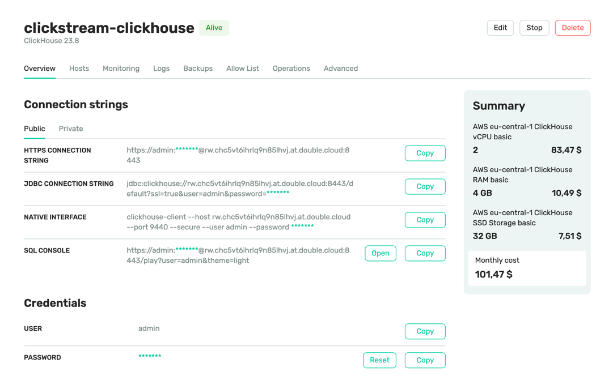
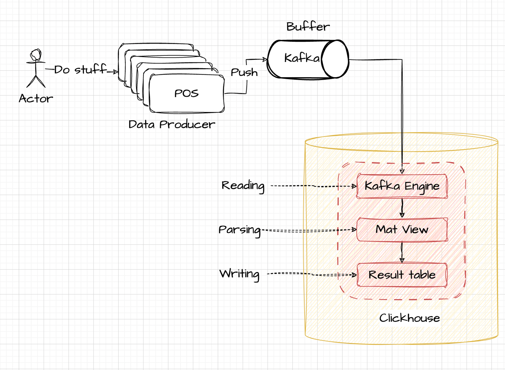
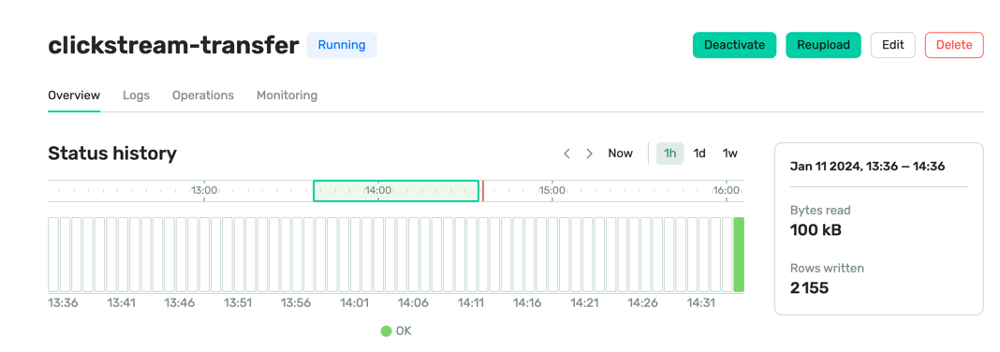
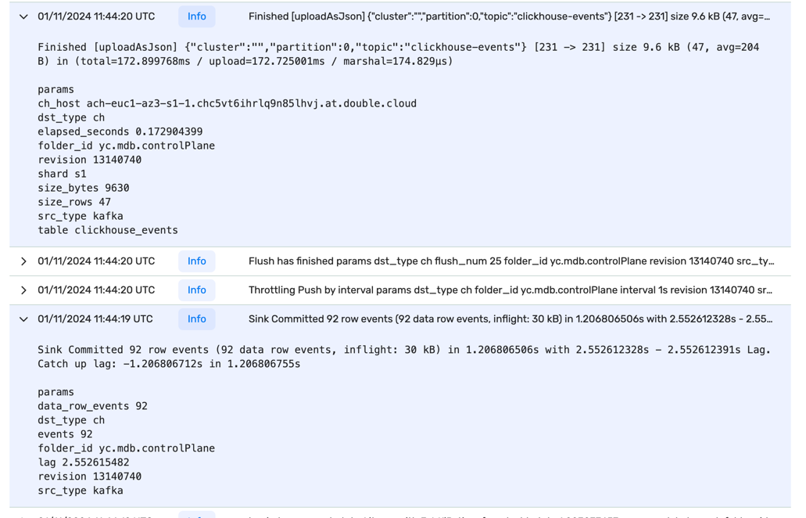
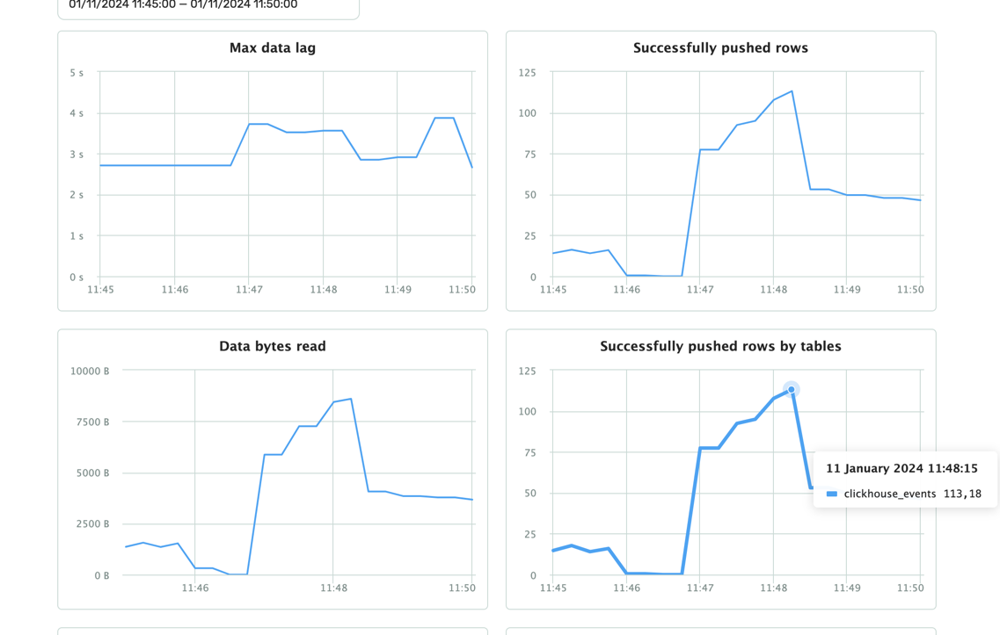

## Clickstream App

Clickstream Demo app for realtime analytics powered by Double.Cloud.

This example create a simple clicstream infrastructure:

1. Kafka stream buffer
2. Clickhouse as click storage
3. Transfer or Kafka Engine as click delivery mechanism
4. Small go-demo producer to generate sample data

**Baseline Architecture**


This project written in terraform, to apply this project run:

```shell
 terraform apply \
  -var="my_ip=$(curl -4 ifconfig.me)" \
  -var="my_ipv6=$(curl -6 ifconfig.me)" \
  -var="project_id=YOUR_PROJECT_ID"
```

Once terraform is applied you will see your credentials:

```shell
Apply complete! Resources: 1 added, 0 changed, 0 destroyed.

Outputs:

clikchouse_connection = {
  "host" = "CLICKHOUSE_HOST"
  "https_port" = 8443
  "password" = "CLICKHOUSE_PASSWORD"
  "tcp_port_secure" = 9440
  "user" = "admin"
}
kafka_connection = {
  "connection_string" = "KAFKA_HOST:9091"
  "password" = "KAFKA_PASSWORD"
  "user" = "admin"
}
```

Clusters would be visible in UI:

**Kafka:** 


**Clickhouse:**



Once we have a clusters setup we can start building a clickstream solution from it.

### Upload sample data

Let's try to upload some sample data, for that's need we have a demo go-application that upload demo data.
Since we expose cluster to our local machine by allow list, we can simply run our application from same host to generate load. For production use cases you should concider to setup networking access via [this](https://double.cloud/docs/en/vpc/connect-dc-to-aws) guide.
[kafka.tf#L21-L34](./kafka.tf#L21-L34)
```tf
  access {
    ipv4_cidr_blocks = [
      {
        value       = "${var.my_ip}/32"
        description = "My IP4 for local access"
      }
    ]
    ipv6_cidr_blocks = [
      {
        value       = "${var.my_ipv6}/128"
        description = "My IP6 for local access"
      }
    ]
  }
```


```shell
cd producer
go mod tidy
go build .
./producer -broker=KAFKA_HOST:9091 -user=admin -password=KAFKA_PASSWORD --message-count=10 -topic=clickhouse-events
message: 1 written
....
message: 10 written
```

### Read sample data

To verify that data uploaded let's read it:

```shell
cd consumer
go mod tidy
go build .
./consumer  -broker=KAFKA_HOST:9091 -user=admin -password=KAFKA_PASSWORD -topic=clickhouse-events
{"user_ts": "2024-01-10T16:14:17Z", "id": 325251000, "name": "test_10_71"}
.....
{"user_ts": "2024-01-10T16:14:17Z", "id": 325252000, "name": "test_10_73"}
```

## Clikchouse delivery via Kafka Engine

ClickHouse can read messages directly from a Kafka topic using the Kafka table engine coupled with a materialized view that fetches messages and pushes them to a ClickHouse target table.
The target table is typically implemented using `*MergeTree` engine or a variant like `Replicated*MergeTree`.
The flow of messages is illustrated below:

Topic -> Kafka Engine Table -> Materialized View to parse -> Final Table:


Let's create example tables:

[kafka_stream_engine.sql#L1-L10](./kafka_stream_engine.sql#L1-L10)
```sql
-- Clickhouse queue wrapper
CREATE TABLE demo_events_queue ON CLUSTER '{cluster}' (
  user_ts String,
  id UInt64,
  message String
) ENGINE = Kafka SETTINGS
    kafka_broker_list = 'KAFKA_HOST:9091',
    kafka_topic_list = 'clickhouse-events',
    kafka_group_name = 'uniq_group_id',
    kafka_format = 'JSONEachRow';
```

As you see in example we don't need to specify auth details for kafka engine, since it already passed during cluster setup here:
[clickhouse.tf#L20-L25](./clickhouse.tf#L20-L25)
```tf
    kafka {
      security_protocol = "SASL_SSL"
      sasl_mechanism    = "SCRAM_SHA_512"
      sasl_username = resource.doublecloud_kafka_cluster.input-kafka.connection_info.user
      sasl_password = resource.doublecloud_kafka_cluster.input-kafka.connection_info.password
    }
```

As a result you will see:

```sql
CREATE TABLE demo_events_queue ON CLUSTER `{cluster}`
(
    `user_ts` String,
    `id` UInt64,
    `message` String
)
ENGINE = Kafka
SETTINGS kafka_broker_list = 'KAFKA_HOST:9091', kafka_topic_list = 'clickhouse-events', kafka_group_name = 'uniq_group_id', kafka_format = 'JSONEachRow'

Query id: 03387739-2e46-459b-957d-ff776867b741

┌─host───────────────────────────────────────────────────┬─port─┬─status─┬─error─┬─num_hosts_remaining─┬─num_hosts_active─┐
│ YOUR_CLICKHOUSE_HOST                                   │ 9440 │      0 │       │                   0 │                0 │
└────────────────────────────────────────────────────────┴──────┴────────┴───────┴─────────────────────┴──────────────────┘

1 row in set. Elapsed: 0.423 sec.
```

Now we need to create storage table (Replicated Merge Tree):
[kafka_stream_engine.sql#L12-L23](./kafka_stream_engine.sql#L12-L23)
```sql
-- Table to store data
CREATE TABLE demo_events_table ON CLUSTER '{cluster}' (
                          topic String,
                          offset UInt64,
                          partition UInt64,
                          timestamp DateTime64,
                          user_ts DateTime64,
                          id UInt64,
                          message String
) Engine = ReplicatedMergeTree('/clickhouse/tables/{shard}/{database}/demo_events_table', '{replica}')
PARTITION BY toYYYYMM(timestamp)
ORDER BY (topic, partition, offset);
```

And as final touch delivery materialized view:
[kafka_stream_engine.sql#L25-L34](./kafka_stream_engine.sql#L25-L34)
```sql
-- Delivery pipeline
CREATE MATERIALIZED VIEW readings_queue_mv TO demo_events_table AS
SELECT
        _topic as topic,
        _offset as offset,
        _partition as partition,
        _timestamp as timestamp,                                             -- kafka engine virtual column
        toDateTime64(parseDateTimeBestEffort(user_ts), 6, 'UTC') as user_ts, -- example of complex date parsing
        id, message
FROM demo_events_queue;
```

To verify that's all good let's check what inside target table:

```sql
SELECT count(*)
FROM demo_events_table

Query id: f2637cee-67a6-4598-b160-b5791566d2d8

┌─count()─┐
│     439 │
└─────────┘

1 row in set. Elapsed: 0.336 sec.
```

This whole setup works inside clickhouse, its simple, but yet powerful.
The utilization of KafkaEngine is robust, yet it introduces unresolved challenges:

1. **Offset Management**: In the event of malformed data entering Kafka, ClickHouse may become unresponsive until manual offset deletion by an administrator—an inherently labor-intensive task.
2. **Limited Visibility**: Monitoring poses a challenge as all operations occur within ClickHouse, necessitating reliance on ClickHouse logs as the sole means of gaining insights into system activities.
3. **Scalability Concerns**: Handling parsing and reading within the ClickHouse cluster itself may impede the seamless scaling of read and write operations during periods of heightened demand, potentially leading to CPU and I/O concurrency issues.

## Clikchouse delivery via DoubleCloud.Transfer

At Double.Cloud, our robust EL(t) engine, Transfer, boasts a pivotal feature—Queue Engine -> ClickHouse delivery. In crafting this delivery mechanism, we proactively addressed the lingering challenges:

1. **Automated Offset Management:** We've implemented automatic unparsed tables, streamlining the handling of corrupt data and eliminating the need for manual intervention in offset management.
2. **Enhanced Visibility:** To overcome the limited visibility inherent in ClickHouse, we've developed dedicated dashboards and alerts that provide real-time insights into specific delivery metrics. This includes comprehensive monitoring of data lag, delivered rows, and delivered bytes.
3. **Dynamic Scalability:** Transfer deploys delivery jobs externally, within Kubernetes, EC2, or GCP instances, allowing for independent scaling separate from the ClickHouse cluster. This ensures optimal scalability to meet varying demands without compromising performance.

Also Double.Cloud Transfer enable automatic schema creation / migration capabilities, therefore no need to perform any extra steps on clickhouse side.

Let's create transfer via terraform:
```shell
 terraform apply \
  -var="my_ip=$(curl -4 ifconfig.me)" \
  -var="my_ipv6=$(curl -6 ifconfig.me)" \
  -var="project_id=YOUR_PROJECT_ID" \
  -var="enable_transfer=true"
```

This option will create a transfer, from `./transfer.tf`

Main thing on transfer configuration - parser rule:

[transfer.tf#L15-L44](./transfer.tf#L15-L44)
```hcl
      parser {
        json {
          schema {
            fields {
              field {
                name     = "user_ts"
                type     = "datetime"
                key      = false
                required = false
                path     = ""
              }
              field {
                name     = "id"
                type     = "uint64"
                key      = false
                required = false
                path     = ""
              }
              field {
                name     = "message"
                type     = "utf8"
                key      = false
                required = false
                path     = ""
              }
            }
          }
          null_keys_allowed = false
          add_rest_column   = true
        }
```

After apply it will create transfer:



This transfer automatically create a table called: `clickhouse_events`, name was infered from source topic name, and delivery a rows into it:

```sql
SELECT count(*)
FROM clickhouse_events

Query id: 04813338-c261-49e4-b729-881f00dc290d

┌─count()─┐
│    6502 │
└─────────┘

1 row in set. Elapsed: 0.323 sec.
```

To see what happens inside you can explore transfer logs and metrics:

**Logs**


**Metrics**


Aproach with Transfer (i.e. separate delivery mechanism) is much more reliable and scalable, and in some cases even easier to setup, since all setup in one place (terraform).

## How to choose right delivery mechanism

If delivery is critical - use external writer.
If format is unstable - use external writer.
If delivery can be huge (10+ mb/s) - use external writer.
If delivery small and format is very stable - use KafkaEngine.
If you need complex parsing inside clickhouse - use KafkaEngine.
