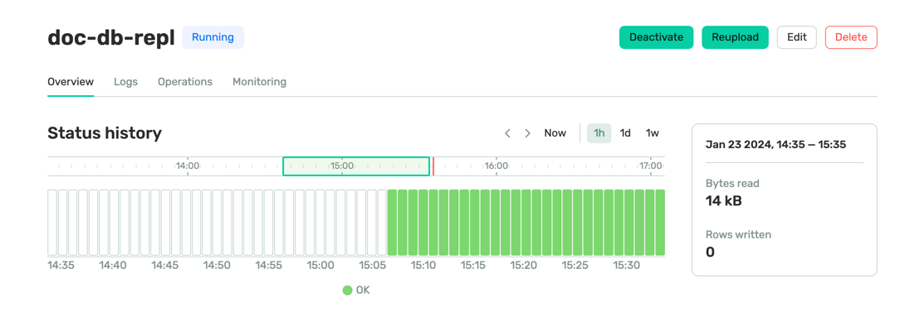

# Terraform Project: AWS Integra
tion with DoubleCloud Infrastructure for AWS DocDB and ClickHouse

This Terraform project aims to integrate an existing AWS infrastructure with a DoubleCloud environment. It establishes connectivity between AWS resources and DoubleCloud while setting up an AWS DocDB instance and a DoubleCloud ClickHouse cluster. The project also includes configurations for data transfer from AWS DocDB to DoubleCloud ClickHouse and visualization setup for dashboards.

## Project Structure

### 1. `aws_infra.tf`


This file manages the existing AWS infrastructure. It may contain configurations for VPCs, subnets, security groups, and other AWS-specific resources.

### 2. `dc_vpc.tf`


Establishes the connectivity between AWS and DoubleCloud by setting up the necessary Virtual Private Cloud (VPC) Peering to ensure communication between the environments.

### 3. `dc_clickhouse.tf`


Creates the ClickHouse cluster within the DoubleCloud VPC. This file sets up ClickHouse configurations, instances, databases, and necessary resources in the DoubleCloud environment.

### 4. `dc_transfer.tf`


Configures the data transfer mechanism from the AWS DocDB instance to the DoubleCloud ClickHouse cluster. This will involve setting up snapshot transfer ELT-worker.

## Getting Started

1. **Prerequisites:** Ensure you have Terraform installed.
2. **Clone the Repository:** Clone this repository to your local environment.
3. **AWS Credentials:** Set up AWS credentials (`default` profile).
4. **Double Cloud Credentials:** Set up Double Cloud credentails, see [this]( https://double.cloud/docs/en/public-api/tutorials/transfer-api-quickstart) link for details.
4. **Prepare Variables:** Prepare variables in the `env.tfvars` files as needed, or path them from CLI-arguments.
5. **Terraform Apply:** Run `terraform init` followed by `terraform apply` to provision the infrastructure.

Example run configuration
```shell
terraform apply \
  -var="db_password=Password" \
  -var="db_username=tutorial_admin" \
  -var="my_ip=$(curl -4 ifconfig.me)" \
  -var="my_ipv6=$(curl -6 ifconfig.me)" \
  -var="dc_project_id=MY_PROJECT"
```

As output you will see:

```hcl
Outputs:

doc_db_connection = "tf-demo-docdb.cluster-YOUR_CLUSTER_ID.eu-west-2.docdb.amazonaws.com"
public_dns = "YOUR_PUBLIC_DNS"
public_ip = "YOUR_PUBLIC_IP"
```

### Populate some data

Connect to Jump Host:
```shell
ssh ubuntu@YOUR_PUBLIC_IP
```

And then install mongodb drivers:
```shell
sudo apt update
sudo apt install mongodb-clients

```

Let's add a demo message:

```shell
mongo --ssl --host demo-docdb-0.YOUR_CLUSTER_ID.eu-west-2.docdb.amazonaws.com:27017 --sslCAFile global-bundle.pem --username tutorial_admin --password Password

rs0:PRIMARY> use demo
switched to db demo
rs0:PRIMARY> db
demo
rs0:PRIMARY> db.messages.insert({text: "hello 1"})
WriteResult({ "nInserted" : 1 })
rs0:PRIMARY> db.messages.find()
{ "_id" : ObjectId("65afbff572ffb0e925667312"), "text" : "hello 1" }
rs0:PRIMARY> 
```

So you have some data in database, so let's activate a transfer that move this collection into DC Clickhouse.



Let's check that data is moved:

```shell
clickhouse-client --host rw.DC_CLICHOUSE_CLUSTER_ID.at.double.cloud --port 9440 --secure --user admin --password YOUR_PASSWORD

SELECT count(*)
FROM demo_messages

┌─count()─┐
│       1 │
└─────────┘
```

So, let's add one more row in mongo, to check that replication is working:

```shell
rs0:PRIMARY> db.messages.insert({text: "hello 2"})
```

And in clickhouse:

```shell
SELECT count(*)
FROM demo_messages

┌─count()─┐
│       2 │
└─────────┘
```

As we see data transferred to a clickhouse.


## Notes

- Ensure you review and modify variables, such as region-specific configurations or security settings, before applying the Terraform configurations.
- Double-check the IAM roles and permissions for AWS and DoubleCloud resources to ensure smooth connectivity and data transfer.
- For any issues or additional configurations needed, refer to the respective Terraform file and adjust accordingly.

---

Feel free to adjust the sections, descriptions, and images as needed to accurately represent your project structure and integration process!
