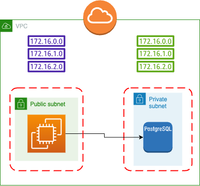
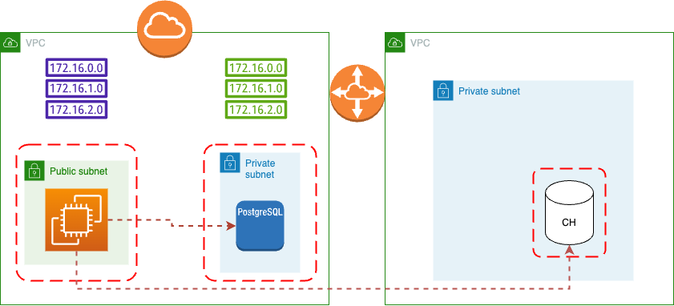
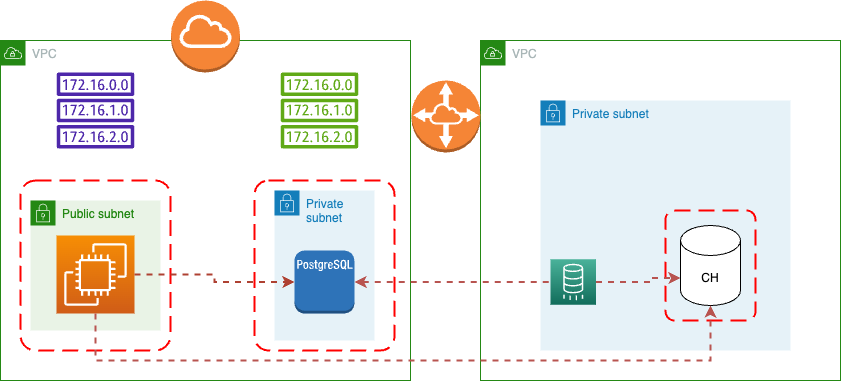
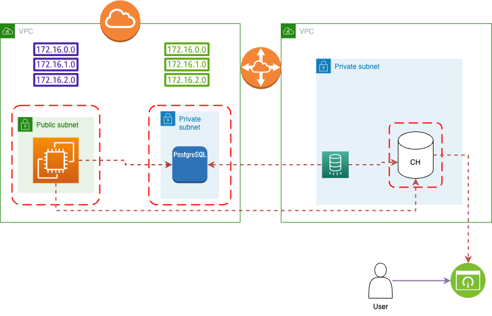

# Terraform Project: AWS Integration with DoubleCloud Infrastructure for RDS and ClickHouse

This Terraform project aims to integrate an existing AWS infrastructure with a DoubleCloud environment. It establishes connectivity between AWS resources and DoubleCloud while setting up an AWS RDS instance and a DoubleCloud ClickHouse cluster. The project also includes configurations for data transfer from AWS RDS to DoubleCloud ClickHouse and visualization setup for dashboards.

## Project Structure

### 1. `aws_infra.tf`


This file manages the existing AWS infrastructure. It may contain configurations for VPCs, subnets, security groups, and other AWS-specific resources.

### 2. `dc_vpc.tf`


Establishes the connectivity between AWS and DoubleCloud by setting up the necessary Virtual Private Cloud (VPC) Peering to ensure communication between the environments.

### 3. `dc_clickhouse.tf`


Creates the ClickHouse cluster within the DoubleCloud VPC. This file sets up ClickHouse configurations, instances, databases, and necessary resources in the DoubleCloud environment.

### 4. `dc_transfer.tf`


Configures the data transfer mechanism from the AWS RDS instance to the DoubleCloud ClickHouse cluster. This will involve setting up snapshot transfer ELT-worker.

### 5. `dc_visualization.tf`


Establishes connections from the DoubleCloud ClickHouse cluster to visualization tools or dashboards. This file might set up connections with tools like Grafana, Tableau, or any other visualization platform for data representation.

## Getting Started

1. **Prerequisites:** Ensure you have Terraform installed.
2. **Clone the Repository:** Clone this repository to your local environment.
3. **AWS Credentials:** Set up AWS credentials (`default` profile).
4. **Double Cloud Credentials:** Set up Double Cloud credentails, see [this]( https://double.cloud/docs/en/public-api/tutorials/transfer-api-quickstart) link for details.
4. **Prepare Variables:** Prepare variables in the `env.tfvars` files as needed, or path them from CLI-arguments.
5. **Terraform Apply:** Run `terraform init` followed by `terraform apply` to provision the infrastructure.

Example run configuration
```shell
terraform apply \
  -var="db_password=Password" \
  -var="db_username=tutorial_admin" \
  -var="my_ip=$(curl -4 ifconfig.me)" \
  -var="my_ipv6=$(curl -6 ifconfig.me)" \
  -var="dc_project_id=MY_PROJECT"
```

## Notes

- Ensure you review and modify variables, such as region-specific configurations or security settings, before applying the Terraform configurations.
- Double-check the IAM roles and permissions for AWS and DoubleCloud resources to ensure smooth connectivity and data transfer.
- For any issues or additional configurations needed, refer to the respective Terraform file and adjust accordingly.

---

Feel free to adjust the sections, descriptions, and images as needed to accurately represent your project structure and integration process!
